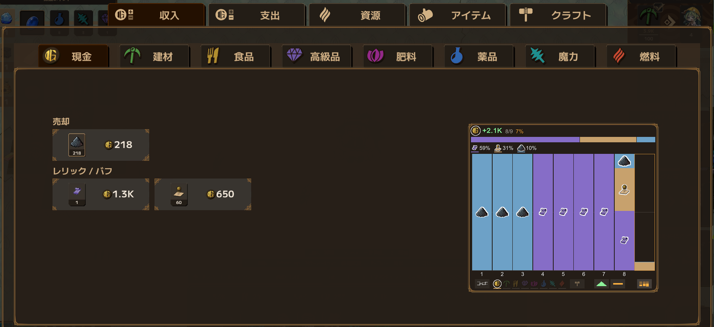
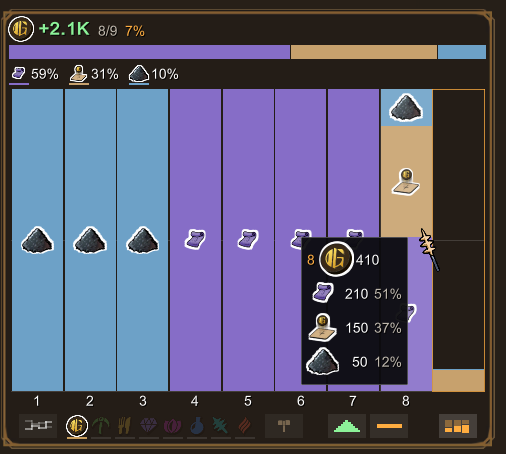
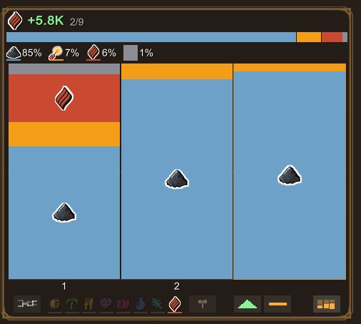
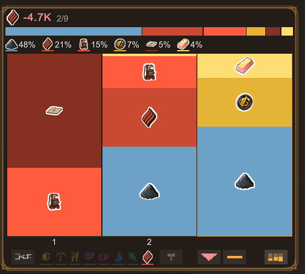
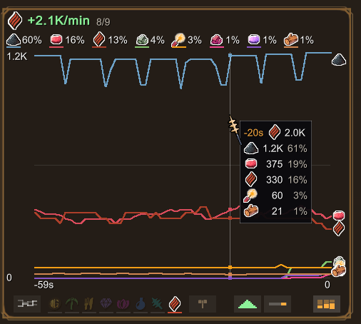
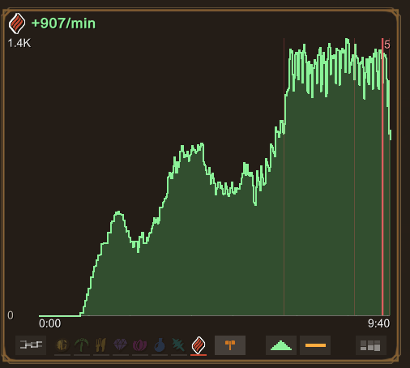
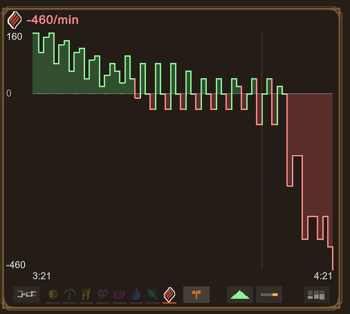
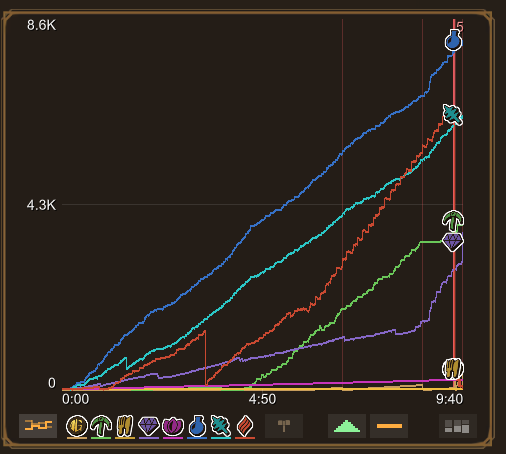
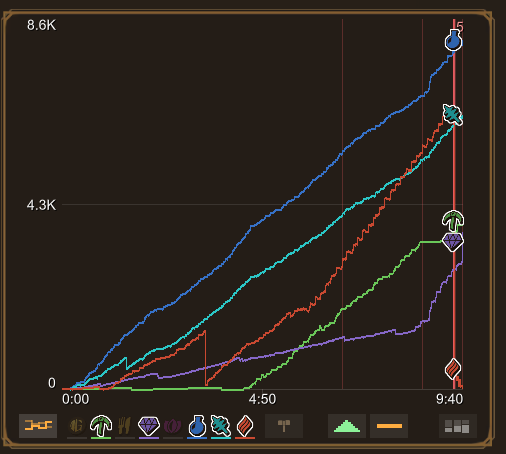
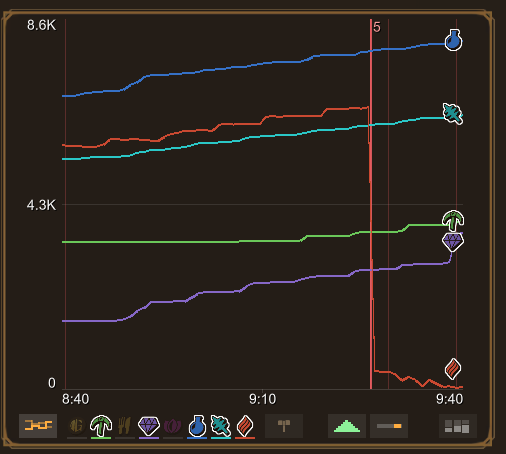

[日本語](README.md)

# LWF Economy Graph

A mod for **Lazy Witch's Factory** that draws income and expense graphs into the game's stats screen.

It draws into the `under development` frame the stats window already has. Nothing about the game's look or progression is touched.

**[Download the latest release](https://github.com/KiyonakaNata/lwf-economy-graph/releases/latest)**

---

## What it does

### Balance per repayment

- One bar per repayment
- Stacked by what actually paid for it
- Hover a bar for the full breakdown of that repayment

Resources work the same way, not just cash (left: income, right: expense)

  
  

### Rate

Set the range to the last minute and it turns into a **rate line chart**.

- Shows what is contributing how much, right now
- Counted the way the game counts (sum over the last 60 seconds), so **the right edge of a line matches the number on the game's own card**
- Hover to read the value at that moment

### Factory balance

Per-minute change of each resource, counting the factory only. The moment you go into the red shows up as shape.

- Counts mining, production and delivery only
- One-off changes — relics, staves, land purchases, penalties — are left out

On the left the factory keeps running at 100%; on the right it will stop as soon as the fuel stock is gone.

  
  

### Balance over time

- Stock of each resource
- A vertical line marks every repayment
- **Click the icon at the right end of a line to hide that line**
  - The resource icons on the toolbar do the same, and bring hidden lines back

  
  

(left: all, right: some hidden)

The range can be set to the last minute here as well.

---

## Install

1. Install **BepInEx 5** — [downloads](https://github.com/BepInEx/BepInEx/releases)
   - Get `BepInEx_win_x64_5.4.x.zip`
   - Extract it into the game folder (the one that holds `LazyWitchsFactory.exe`)

     > **Where the game folder is** (Steam)
     > Right-click the game in your library → Manage → Browse local files

2. Run the game once and quit, so that `BepInEx/plugins` and the rest are created
3. Take `LwfEconomyGraph.dll` out of this mod's zip and put it in **`BepInEx/plugins/`**
4. Start the game, open the stats screen, and check that the graph is there

## Uninstall

**This mod only**

- `BepInEx/plugins/LwfEconomyGraph.dll`
- To clear its settings and CSVs as well: `BepInEx/config/kiyonakanata.lwfeconomygraph.cfg` and `BepInEx/LwfEconomy/`

**BepInEx along with it** (every other mod stops too)

- The `BepInEx` folder
- `winhttp.dll`, `doorstop_config.ini` and `.doorstop_version` in the game folder

---

## Usage

- Just open the stats screen — **the graph is already there**
- Nothing to do on each launch

Everything is on the toolbar under the graph.

| Button | What it does |
|---|---|
| Overlaid lines | All 8 resource balances at once |
| Resource icon | Look at that resource (while overlaid: show / hide it) |
| Hammer | Factory balance of the selected resource |
| Triangle | Income ↔ expense |
| Bar | Whole run ↔ last minute |
| Stack | Breakdown per repayment |

Resource, side and range **stay in sync with the game's own stats window**.

Only two keys are bound.

| Key | Action |
|---|---|
| **F5** | Cycle the view (same as the toolbar) |
| **F8** | Write the record out as CSV (`BepInEx/LwfEconomy/`) |

F8 is **for bug reports**.

If the numbers look wrong, attach that file and the same record can be replayed here.

---

## Settings

**You should not need to touch any of this.**

For when you really do want to change something, edit `BepInEx/config/kiyonakanata.lwfeconomygraph.cfg` (created once the game has run).

| Key | Default | Meaning |
|---|---|---|
| `Enabled` | `true` | `false` stops both recording and drawing (game behaves as if the mod were absent) |
| `EmbedInStatsWindow` | `true` | `false` draws in a separate panel instead of the stats window |
| `StartMode` | `0` | View to open with (0 = factory balance, 1 = balance over time, 2 = balance per repayment) |
| `FontName` | empty | Set a font name only if text renders as □ (e.g. `Yu Gothic UI`) |
| `IconOutlineWidth` | `0.05` | Width of the white outline on icons (`0` for none) |

---

## Requirements

| | |
|---|---|
| Lazy Witch's Factory | built and checked on **ver 0.24.1** |
| BepInEx | checked with **5.4.23.5** (any 5.4.x should do) |

A game update can stop the graph from showing up. If it stops working, delete it.

## Note

- The record is gone when you quit the game (use F8 to keep it for a report)

---

## When it doesn't work

Look at `BepInEx/LogOutput.log` first. The mod logs in Japanese, so the lines below are quoted as they appear.

| Log | Where you stand |
|---|---|
| no `[boot] LWF Economy Graph ...` line | **Not loaded** — check where the DLL ended up |
| `統計窓の ... が見つからない` | **The graph works** — but the toolbar won't stay in sync with the game's window |
| `土地購入を挟めなかった` | **The graph works** — but land purchases land under "other" |
| `例外が 20 回続いたので、このMODを止めました` | **Stopped itself** — the game behaves as if the mod were absent |

**A bug report** is most useful with these three:

- a screenshot
- `BepInEx/LogOutput.log`
- the CSV from F8

---

## Disclaimer

- **Unofficial mod** — not supported by the developer
- Anything that happens with it installed — bugs, crashes, broken saves — is at your own risk
- A game update can break it

Built in line with the [official stance on mods](https://store.steampowered.com/news/app/3971650/view/699897618302503133) (Japanese).

The source is MIT licensed. The screenshots under `img/` are captures of the game and belong to its developer.
